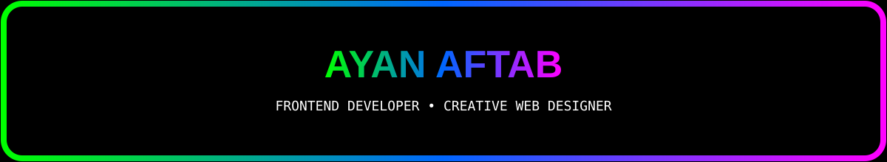

 

<picture>
  <source media="(prefers-color-scheme: dark)" srcset="https://readme-typing-svg.demolab.com?font=Fira+Code&weight=600&size=21&duration=2800&pause=900&color=FFFFFF&center=true&vCenter=true&width=750&lines=Frontend+Developer+%7C+Creative+Web+Designer;Building+Clean+%26+Responsive+Websites;Learning+Full+Stack+Development;Code+%7C+Design+%7C+Cars+%7C+Motorsports">
  <source media="(prefers-color-scheme: light)" srcset="https://readme-typing-svg.demolab.com?font=Fira+Code&weight=600&size=21&duration=2800&pause=900&color=000000&center=true&vCenter=true&width=750&lines=Frontend+Developer+%7C+Creative+Web+Designer;Building+Clean+%26+Responsive+Websites;Learning+Full+Stack+Development;Code+%7C+Design+%7C+Cars+%7C+Motorsports">
  
</picture>

  

<picture>
  <source media="(prefers-color-scheme: dark)" srcset="https://readme-typing-svg.demolab.com?font=Fira+Code&weight=700&size=18&duration=1800&pause=300&color=FFFFFF&center=true&vCenter=true&width=800&lines=%F0%9F%92%BB+BUILD+%E2%80%A2+%F0%9F%8E%A8+DESIGN+%E2%80%A2+%E2%9A%A1+CREATE+%E2%80%A2+%F0%9F%9A%80+LEARN+%E2%80%A2+%F0%9F%8F%8E%EF%B8%8F+EXPLORE">
  <source media="(prefers-color-scheme: light)" srcset="https://readme-typing-svg.demolab.com?font=Fira+Code&weight=700&size=18&duration=1800&pause=300&color=000000&center=true&vCenter=true&width=800&lines=%F0%9F%92%BB+BUILD+%E2%80%A2+%F0%9F%8E%A8+DESIGN+%E2%80%A2+%E2%9A%A1+CREATE+%E2%80%A2+%F0%9F%9A%80+LEARN+%E2%80%A2+%F0%9F%8F%8E%EF%B8%8F+EXPLORE">
  
</picture>

  

---

## 🧑‍💻 About Me

Hey! I'm **Ayan Aftab**, a passionate **Frontend Developer** from Pakistan 🇵🇰 who enjoys turning ideas into clean, responsive, and creative web experiences.

* 🔭 Currently working on **Frontend Projects & YouTube Homepage Clone**
* 🌱 Currently learning **Full Stack Web Application Development**
* 👯 Looking to collaborate on **Web Development Projects**
* 💻 Interested in **Frontend Development & Creative Web Design**
* 📝 I regularly write about **Car History & Automotive Evolution**
* 💬 Ask me about **Frontend Development, HTML, CSS & Web Design**
* 📄 Check out my **[Resume](https://drive.google.com/file/d/1Yofy4fXlD9UDqLtQ7WsL4y6UB23SpgFU/view?usp=sharing)**
* ⚡ Fun fact: **I love writing clean code almost as much as I love BMW M cars & motorsports.**

---

## 🚀 Featured Project

### 🎬 YouTube Homepage Clone

A frontend recreation of the YouTube homepage built to improve my **HTML, CSS and responsive design** skills.

 

---

## 🌐 My Platforms

---

## 🛠️ Languages & Tools

---

## 💻 Developer Mode

**AYAN AFTAB // FRONTEND DEVELOPER**

 

`Frontend Development` • `Creative Web Design` • `Responsive UI` • `Clean Code`

  

> Building modern web experiences with a focus on
> **clean design, responsive layouts, and purposeful code.**

 

**CURRENT FOCUS**

`HTML` `CSS` `JavaScript` `UI/UX` `Full Stack Development`

 

**MINDSET**

`Learn → Build → Improve → Repeat`

 

⚡ **Turning ideas into clean, functional digital experiences.**

---

## 📊 GitHub Overview

  

---

## 📈 Contribution Activity

---

## 🤝 Connect With Me

---

<picture>
  <source media="(prefers-color-scheme: dark)" srcset="https://readme-typing-svg.demolab.com?font=Fira+Code&weight=700&size=18&duration=1800&pause=300&color=FFFFFF&center=true&vCenter=true&width=700&lines=%E2%9A%A1+CODE+%E2%80%A2+CREATE+%E2%80%A2+DEBUG+%E2%80%A2+REPEAT+%E2%9A%A1">
  <source media="(prefers-color-scheme: light)" srcset="https://readme-typing-svg.demolab.com?font=Fira+Code&weight=700&size=18&duration=1800&pause=300&color=000000&center=true&vCenter=true&width=700&lines=%E2%9A%A1+CODE+%E2%80%A2+CREATE+%E2%80%A2+DEBUG+%E2%80%A2+REPEAT+%E2%9A%A1">
  
</picture>

  

<picture>
  <source media="(prefers-color-scheme: dark)" srcset="https://readme-typing-svg.demolab.com?font=Fira+Code&size=16&duration=2500&pause=700&color=FFFFFF&center=true&vCenter=true&width=650&lines=Clean+Code.+Creative+Design.+Fast+Cars.;Always+Learning.+Always+Building.;Turning+Ideas+Into+Digital+Experiences.">
  <source media="(prefers-color-scheme: light)" srcset="https://readme-typing-svg.demolab.com?font=Fira+Code&size=16&duration=2500&pause=700&color=000000&center=true&vCenter=true&width=650&lines=Clean+Code.+Creative+Design.+Fast+Cars.;Always+Learning.+Always+Building.;Turning+Ideas+Into+Digital+Experiences.">
  
</picture>

  

🏎️ **Code with precision. Build with passion.**

  

